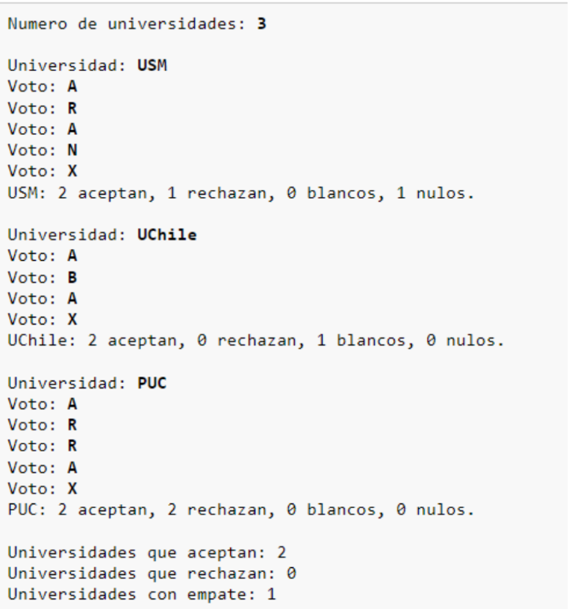

# Readme Fourth Challenge Push Up

### Enunciado

> La CONFECH, en su afán de agilizar el proceso de recuento de las votaciones, le ha encargado el
desarrollo de un programa de registro de votación por universidades.

> Primero, el programa debe solicitar al usuario ingresar la cantidad de universidades que participan
en el proceso.
Luego, para cada una de las universidades, el usuario debe ingresar el nombre de la universidad y

>los votos de sus alumnos, que pueden ser: aceptar (A), rechazar (R), nulo (N) o blanco (B). El término
de la votación se indica ingresando una X, tras lo cual se debe mostrar los totales de votos de la
universidad, con el formato que se muestra en el ejemplo.

---------------------------------------------------------------

- Finalmente, el programa debe mostrar el resultado de la votación, indicando la cantidad de
universidades que aceptan, que rechazan y en las que hubo empate entre estas dos opciones.

## Como debe imprimirse

---------------------------------------------------------------

> Los resultados se imprimen en la consola

> El programa esta hecho para que diferentes y ordenados prompts, el usuario pueda digitar toda la información de los votos

1. Primero digitar el numero de universidades
2. Digitar el nombre de la universidad y los votos
3. Con la X guardas los votos
4. El mismo proceso dependiendo de cuantas universidades hayas puesto